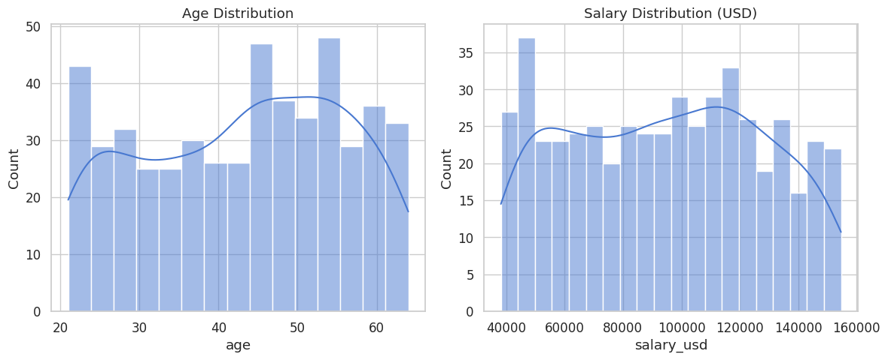
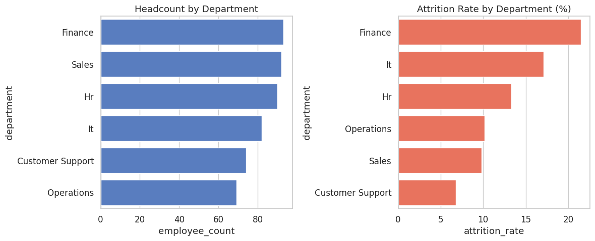
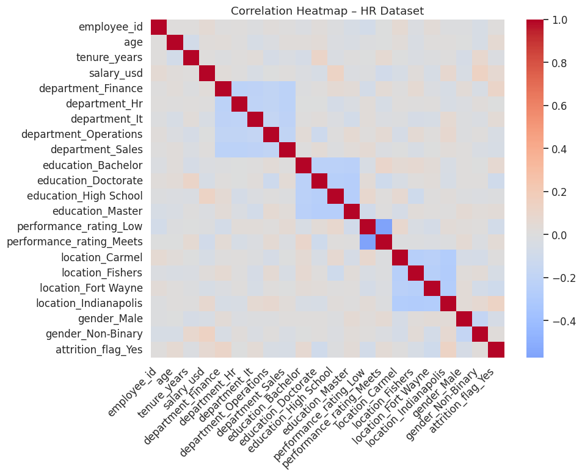
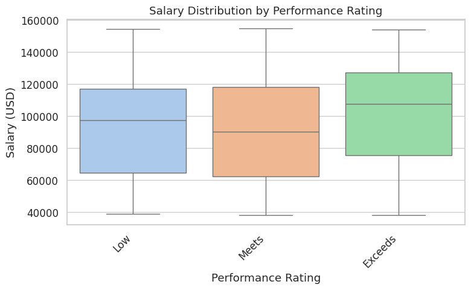
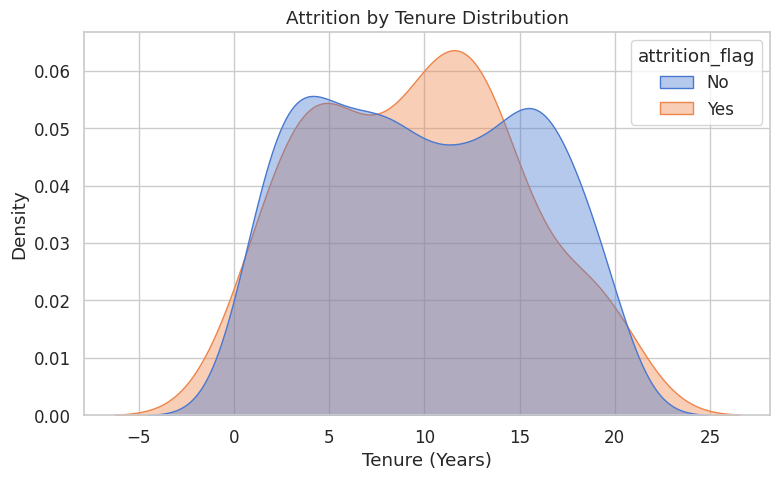
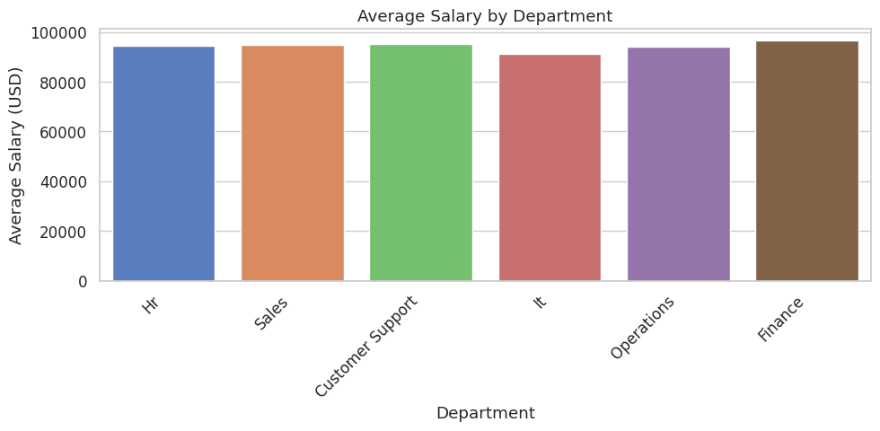

# 🧠 HR Analytics and Data Quality Pipeline

This project demonstrates an end-to-end **HR analytics and data-quality workflow** using Python and SQL.  
It cleans, validates, and explores workforce data to uncover trends in **attrition**, **salary**, and **performance** — showcasing enterprise-grade data analysis and visualization skills.

---

## 📊 Key Objectives

- Generate and preprocess synthetic HR data
- Validate and clean datasets for analytics
- Load cleaned data into **DuckDB** for SQL queries
- Perform summary analytics (headcount, salary, attrition)
- Visualize key metrics using **Matplotlib** and **Seaborn**
- Produce a reproducible data-quality and insight pipeline

---

## ⚙️ Tech Stack

| Component | Technology |
|------------|-------------|
| Language | Python 3.11 |
| Database | DuckDB (embedded SQL engine) |
| Libraries | pandas, numpy, seaborn, matplotlib, scikit-learn |
| Tools | JupyterLab, Git, Conda |
| Data | Synthetic workforce data generated locally |

---

## 🧩 Repository Structure
```text
hr-analytics-and-data-quality-pipeline/
├── data/
│ ├── synthetic_hr_records.csv
│ ├── hr_cleaned.csv
│ └── hr_data_mart.duckdb
├── figures/
│ ├── data_quality_distributions.png
│ ├── hr_department_insights.png
│ ├── hr_correlation_heatmap.png
│ ├── salary_vs_performance.png
│ ├── attrition_by_tenure.png
│ └── avg_salary_by_department.png
├── sql/
│ └── hr_summary_queries.sql
├── hr_analytics_pipeline.ipynb
├── requirements.txt
├── .gitignore
└── README.md


---

## 📈 Visualizations

| Visualization | Description |
|----------------|--------------|
|  | Age and salary distributions for quality checks |
|  | Headcount and attrition by department |
|  | Feature correlations across numeric and encoded fields |
|  | Salary distribution by performance rating |
|  | Attrition patterns by tenure |
|  | Average salary by department |

---

## 🧠 Summary and Next Steps

**Completed:**
- Synthetic data generation and cleaning  
- Data validation and outlier control  
- SQL summaries and departmental KPIs  
- Exploratory visualizations  

**Next:**
- Add time-series trend analysis for attrition  
- Integrate Power BI or Streamlit dashboards  
- Connect to cloud sources (AWS S3 or Oracle)  
- Automate nightly data-quality checks  

---

## 💻 Setup Instructions

```bash
# Create and activate environment
conda create -n hr-analytics python=3.11 -y
conda activate hr-analytics

# Install dependencies
pip install -r requirements.txt

# Launch JupyterLab
jupyter lab

🧾 License

This project is released under the MIT License.

👤 Author

Michael S. Mohle
Data Analyst • Applied AI & SQL Integration
